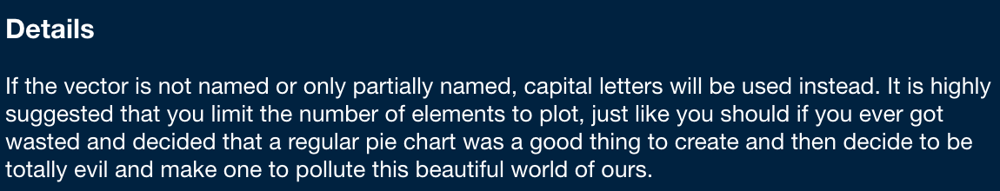
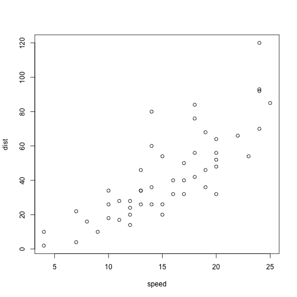

Pie Charts: Friend or Foe?
========================================================
author: Rachel Tao, MPH
date: 10/19/2021
autosize: true

Why do we use pie charts?
========================================================

- Florence Nightingale invented the pie chart
- Pie charts are one of the first data visualizations we learn about

Some people really hate pie charts.
========================================================



^ from the R documentation for the waffle package

R does not make it easy to make a pie chart
========================================================


```r
summary(cars)
```

```
     speed           dist       
 Min.   : 4.0   Min.   :  2.00  
 1st Qu.:12.0   1st Qu.: 26.00  
 Median :15.0   Median : 36.00  
 Mean   :15.4   Mean   : 42.98  
 3rd Qu.:19.0   3rd Qu.: 56.00  
 Max.   :25.0   Max.   :120.00  
```

Maybe waffle charts are the way to go
========================================================


Other options
========================================================


